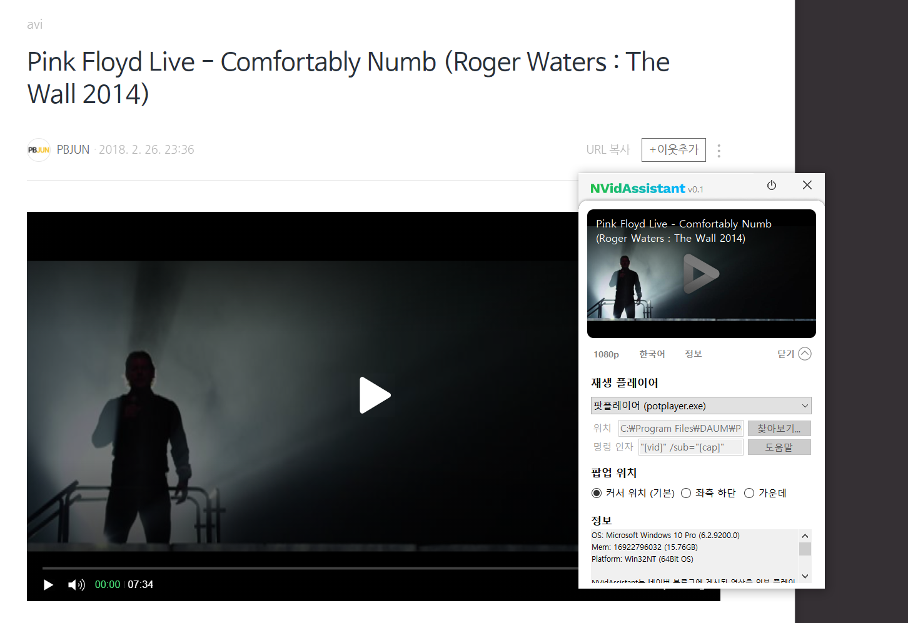

# NVidAssistant

## 소개
네이버 블로그에 업로드된 비디오(자막)를 자막과 함께 외부 플레이어로 재생할 수 있도록 도와주는 프로그램입니다

## 사용 방법
1. 프로그램을 연다
2. 비디오 링크를 복사한다
3. 몇 초 뒤 뜨는 팝업의 재생 버튼을 누른다
4. 즐감

## 종료 방법
* 방법1. 좌측 하단의 프로그램 아이콘을 우클릭 > 종료
* 방법2. 팝업창에서 전원 아이콘 클릭 > 예

## 특장점
- 최적의 화질과 언어를 자동으로 설정하여 바로 재생
- VLC, 팟플레이어, WMP같은 자기에게 익숙한 플레이어를 이용
- 오디오 노멀라이징, 각종 영상 필터 등을 취향에 맞게 적용 가능
- 자막이 포함된 영상의 경우 원하는 폰트로 설정하여 시청할 수 있음
- 크롬캐스트가 있는 경우 VLC를 통해 스트리밍 가능

## 요구 사항
- Windows 7 이상이 설치된 컴퓨터
- .Net Framework 4.6.1 (윈도우10의 경우 거의 기본으로 설치됨)
- 팟플레이어 또는 VLC 플레이어 (미디어 플레이어는 가능은 한데 srt 자막 지원x, 그 외의 플레이어의 경우 별도로 설정하면 이용 가능)

## 자주 물을것 같은 질문
### Q. 이거 바이러스인가요? 왜 안전하지 않다고 뜨는거죠?
A. 막 배포된 프로그램이라 저명성이 떨어지기 때문입니다. 이걸 해결하려면 디지털 인증서를 구매하여 넣으면 되는데 아쉽게도 그럴 돈이 없네요.. (경고는 배포 후 어느정도 지나면 사라질 겁니다)
  진짜루 못 믿으시겠다 그러면 깃헙에 소스코드가 모두 올려져 있으니 직접 받으셔서 빌드하셔서 쓰셔도 됩니다

### Q. 플레이어가 설치되어 있지 않다고 떠요
A. 팟플레이어나 VLC 플레이어를 설치하시고 '재생/팝업 설정' 버튼을 누르셔서 재생 플레이어를 설치하신 플레이어로 맞추시면 됩니다.

### Q. 제가 보려고 하는 영상의 포스트에 접근할 수 없는데 영상 시청이 가능한가요?
A. serviceapi~ 로 시작하는 플레이어 주소를 갖고 있다면 한동안은 볼 수 있습니다. 단, 포스트 주소 (blog.naver.com/~) 만으로는 글 접근이 안되기 때문에 볼 수 없습니다. 비공개 포스트의 비디오의 경우 두 주소 다 접근이 불가합니다.

### Q. 윈도우 11에 돌아가나요?
A. 돌아갑니다.

### Q. 이거 쓰면 잡혀가나요?
A. 가장 큰 영상 추출 프로그램인 youtube-dl이 15년 가까이 멀쩡한 걸 보면 잡혀갈 일은 없을듯 합니다. 다만 그거나 이거나 모두 비공식적인 방법이므로 항상 작동을 보장할 순 없습니다. 만약 써봤는데 먹통이 됐다면 깃헙 이슈란에 보고해 주시면 후딱 고치도록 하겠습니다

## 스크린샷

